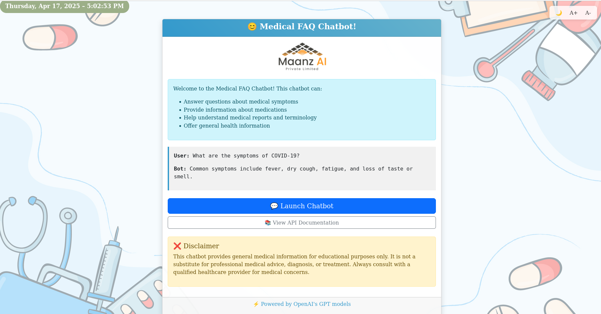
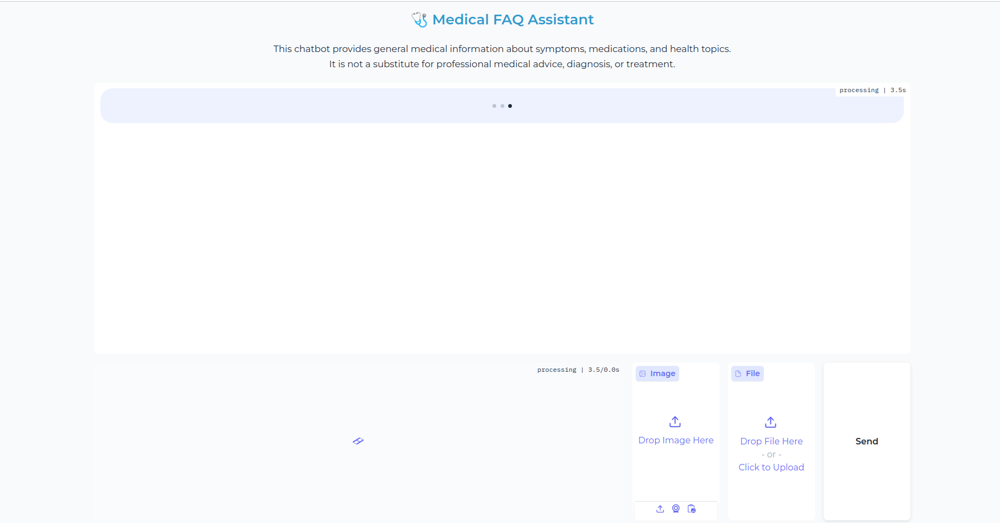

# 🩺 Medical FAQ Chatbot

A GPT-4o-powered medical chatbot that answers questions about symptoms, medications, and health reports. Built with **FastAPI**, **Gradio**, and **OpenAI**, it supports natural conversation, PDF report summaries, and image-based queries (e.g., X-rays) for educational and research purposes.

---

## 🚀 Features

- 💬 Chatbot interface using GPT-4o
- 🧠 Remembers the last 4 interactions for context
- 📄 PDF (lab/report) upload and summarization
- 🖼 X-ray image upload and analysis prompts (educational)
- 🌐 Gradio + FastAPI web interface
- 🧪 Tested with `pytest`

---

## 📸 Screenshots

| Welcome Page | Chat Interface |
|----------------|-----------------|
|  |  |

---

## 🛠 Tech Stack

- **OpenAI GPT-4o**
- **FastAPI**
- **Gradio (custom styled)**
- **LangChain (for text extraction)**
- **PyPDF2** for PDF parsing

---

## 📦 Installation

1. **Clone the repo:**
```bash
git clone https://github.com/your-username/medical-faq-bot.git
cd medical-faq-bot
```

2. **Set up virtual environment:**
```bash
python3 -m venv venv
source venv/bin/activate
```

3. **Install dependencies:**
```bash
pip install -r requirements.txt
```

4. **Add your .env file:**
```bash
cp .env.example .env
```

Edit .env to include your OpenAI API key.

### ▶️ Run the App
```bash
python src/main.py
```

Visit: http://localhost:8000

### 📁 .env Example

OPENAI_API_KEY=your_openai_key_here
MODEL_NAME=gpt-4o
MAX_TOKENS=800
TEMPERATURE=0.3
DEBUG=True
HOST=0.0.0.0
PORT=8000

### 🧪 Run Tests
```bash
pytest tests/
```

### ⚠️ Disclaimer
This project is for educational and research purposes only. It does not provide medical advice or diagnosis. Always consult a certified healthcare provider.

### ⭐ Why I Built This
To explore the integration of multimodal AI for medical education, and to demonstrate how GPT-4o can be used responsibly for structured medical information delivery.

### 📄 License
```bash

---

## ✅ 2. `.gitignore`

```gitignore
# Python
__pycache__/
*.pyc
*.pyo
*.pyd
.env
.venv/
venv/

# IDE
.vscode/
.idea/

# OS
.DS_Store

# Gradio uploads/cache
gradio_cached_examples/
```


